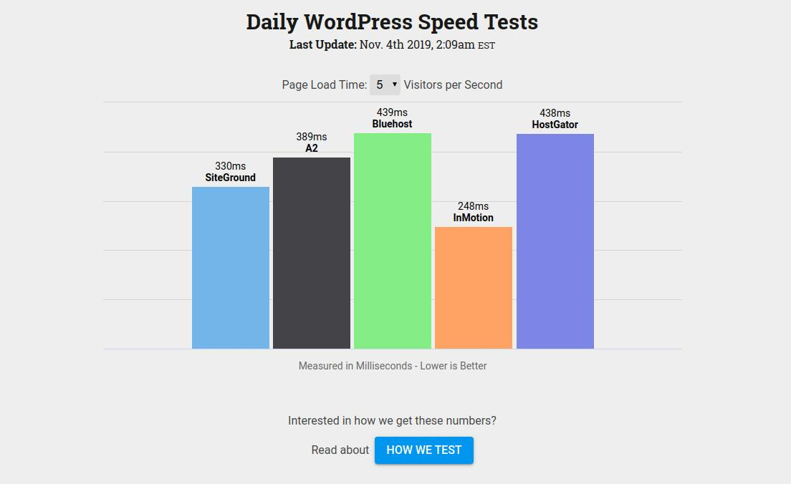

# [WPBenchmarks](https://www.wpbenchmarks.live/)

## Introduction

WPBenchmarks is a hobby project that I began working on a little over a year ago. The premise of the site is _Daily Speed Test Results for Popular WordPress Hosts_. I had two main motives for starting the project:

- **Monetization** - The site has affiliate links throughout.

- **Experimentation** - I wanted to play with tools/frameworks/services/etc. that I don't get to use during the regular workday.

While I'm not a huge WordPress fan myself, I'm aware of how widely used the project is and was hoping to capitalize on its popularity. The rest of this article will summarize the tools, services, and libraries I've used to build the site so far.

## Front-End

I love React, but for the sake of SEO I knew I couldn't make a single page application. Thankfully [Gatsby](https://www.gatsbyjs.org/) was there to fill the gap. Using Gatsby gave me all the benefits of React (component composition, CSS-in-JS, etc.) but still enabled me to render static HTML at build time. It was my first time using Gatsby, but I definitely enjoyed it (and was even able to [contribute back](https://github.com/gatsbyjs/gatsby/pull/11528) to the project).

In addition to Gatsby, I used the libraries below for additional functionality throughout the site:

- [Emotion](https://github.com/emotion-js/emotion) - a CSS-in-JS library
  - [Facepaint](https://github.com/emotion-js/facepaint) - an Emotion extension that makes dealing with media-queries _super_ easy. (seriously, it's so easy. I love it).
- [Highcharts](https://www.highcharts.com/) - for responsively visualizing the speed test results
- [React Spring](https://github.com/react-spring/react-spring) - for some SVG animations on the [_How We Test_ page](https://www.wpbenchmarks.live/how-we-test).

Since the front-end of the site compiles to static HTML, CSS, and JS, it was super easy to host on [Netlify](https://www.netlify.com/), the undisputed champion in static site hosting.

## Back-End

The back-end of the site is powered by a single `bash` script that iterates through a list of hosts and runs the [k6](https://k6.io/) load testing tool on each of them. The script reads and parses the hosts' information from a JSON file using [jq](https://stedolan.github.io/jq/). Once the load testing is complete, the results are parsed and uploaded to AWS's [DynamoDB](https://aws.amazon.com/dynamodb/). Finally, the `bash` script uses `curl` to initiate a POST request to Netlify that triggers the front-end to rebuild and consume the latest DynamoDB entry before deploying the results to production.

Initially the back-end was hosted on an EC2 instance and the `bash` script was initiated by a scheduled 3AM `cron` job. This worked fine but resulted in a lot of wasted resources since the EC2 instance was idle for the majority of the day. I recently revamped the back-end by containerizing it with Docker and using AWS's [ECS](https://aws.amazon.com/ecs/) to schedule the container to run every day at 3AM. By utilizing ECS's [Fargate](https://aws.amazon.com/fargate/) runtime, I was able to eliminate servers entirely and stop paying for idle resources. The result was a cost reduction from $10/month to less than $1/month.

## Conclusion

I've had a blast building WPBenchmarks so far, especially the recent back-end hosting revamp. I haven't quite accomplished my goal of monetizing the site, but it's something I'll certainly continue to work on as time permits. But first, I'll need to figure out a content strategy to start getting some traffic to the site.